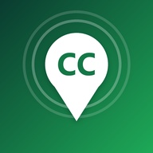
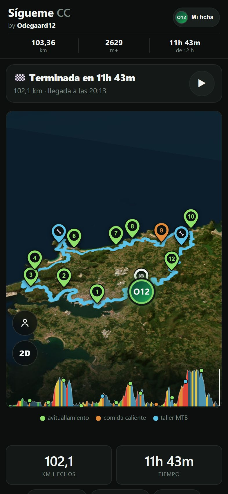
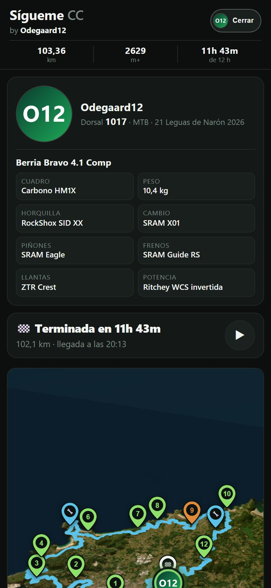
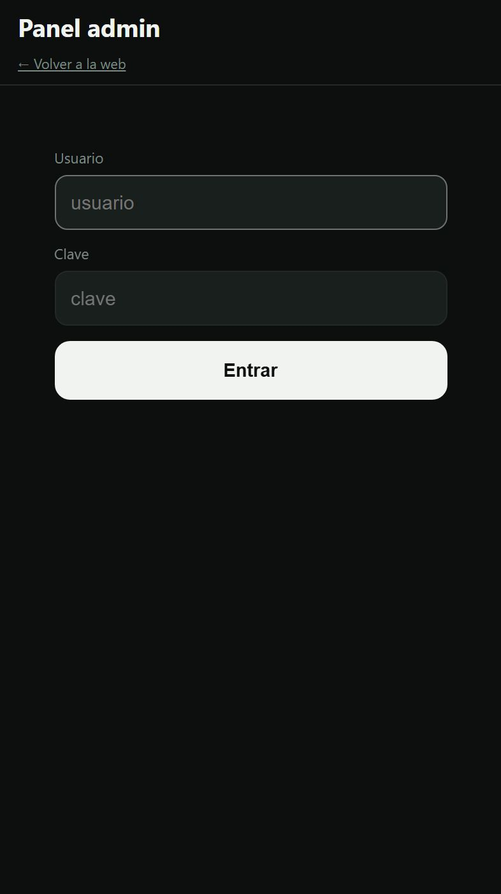
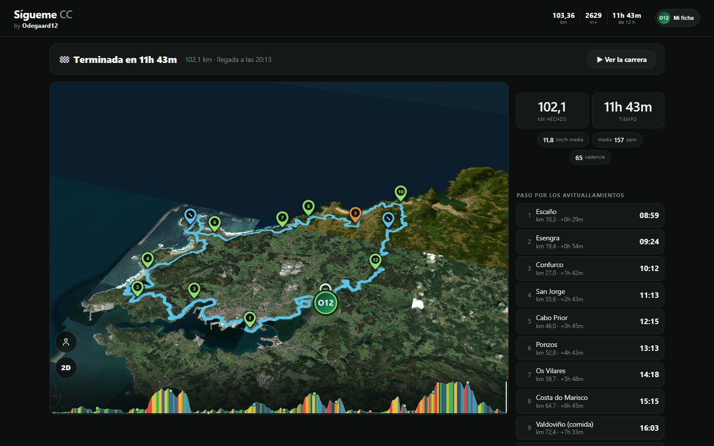

<p align="center">
  
</p>

<h1 align="center">Sígueme CC</h1>

<p align="center">
  Web para que tu familia y amigos te sigan <b>en directo</b> en una carrera de MTB o a pie:<br>
  mapa 3D con tu posición sobre el trazado, perfil, avituallamientos, tiempos y,<br>
  al terminar, el resultado con la repetición de la carrera.
</p>

<p align="center">
  
  
  
  
  
</p>

<p align="center">
  
  &nbsp;
  
  &nbsp;
  
</p>
<p align="center">
  
</p>

---

## Índice

1. [Qué necesitas](#1-qué-necesitas)
2. [Preparar tu carrera](#2-preparar-tu-carrera)
3. [Arrancar el servidor](#3-arrancar-el-servidor)
4. [Elegir cómo se manda tu posición](#4-elegir-cómo-se-manda-tu-posición)
5. [El día de la carrera](#5-el-día-de-la-carrera)
6. [Después de la carrera](#6-después-de-la-carrera)
7. [Cómo funciona por dentro](#cómo-funciona-por-dentro) · [Seguridad](#seguridad) · [Versiones](#versiones)

---

## 1. Qué necesitas

- Un ordenador siempre encendido con **Python 3.9 o superior** (una Raspberry Pi
  va de sobra) y una forma de publicarlo en internet con **https**: un túnel de
  Cloudflare (gratis) es lo más sencillo.
- El **GPX** de la ruta.
- Al menos una forma de mandar tu posición: el **móvil con Traccar Client**
  (gratis), un **reloj Amazfit** o el directo de un ciclocomputador **iGPSPORT**.

## 2. Preparar tu carrera

Todo lo propio de una carrera está en cuatro ficheros de la raíz. El código no
nombra ninguna carrera.

**a) La ruta y el perfil, desde el GPX:**

```bash
python herramientas/preparar_ruta.py ruta.gpx --nombre "Mi carrera" --distancia 103.4
```

Crea `route.geojson` (trazado) y `elevation.json` (perfil y pendientes).
`--distancia` son los km oficiales, si no coinciden con los que mide el GPX.

**b) Los avituallamientos**, en `aid_stations.json` (km de la ruta en que están):

```json
[
  {"name": "Avituallamiento 1", "km": 10.3},
  {"name": "Asistencia mecánica", "km": 46, "taller": true},
  {"name": "Comida", "km": 72.4, "principal": true}
]
```

**c) Los datos de la carrera y del corredor**, en `carrera.json`:

| Campo | Qué es | Ejemplo |
|---|---|---|
| `nombre`, `lugar` | Salen en la ficha y al pie de la web | `"Mi carrera MTB"` |
| `fecha`, `hora_salida` | Día y hora oficial de salida (el cronómetro cuenta desde ahí) | `"2026-09-26"`, `"08:30"` |
| `zona_horaria` | Para enseñar las horas bien aunque quien mira esté en otro país | `"Europe/Madrid"` |
| `distancia_km`, `desnivel_m` | Lo que dice el paso a) | `103.36`, `2629` |
| `limite_h` | Horas para terminar | `12` |
| `km_minimos_meta` | Km hechos para que pasar por meta cuente como llegada (si la salida está junto a la meta). Si falta, el 80 % | `80` |
| `modalidad` | MTB, trail… | `"MTB"` |
| `corredor` | `nombre` y `dorsal` | `{"nombre": "Ana", "dorsal": "27"}` |
| `bici` | `modelo` y `piezas` para la ficha (opcional) | ver el ejemplo |

**d) Tu avatar**, en `rider.png` (cuadrado, 256 px): sale en el mapa y en la ficha.

## 3. Arrancar el servidor

```bash
pip install curl_cffi                      # solo hace falta para iGPSPORT
python3 server.py --hash-clave             # pide una clave y escribe ADMIN_HASH=…
ADMIN_USER=tu_usuario ADMIN_HASH='scrypt:…' python3 server.py 8710
```

- La web queda en `http://localhost:8710` y el **panel** en `/admin.html`
  (usuario y clave del paso anterior; el servidor solo guarda el hash).
- Para dejarlo como servicio, y para tener **dos Raspberry** con una de
  respaldo, sigue [`despliegue/README.md`](despliegue/README.md).

## 4. Elegir cómo se manda tu posición

Puedes usar una sola o varias a la vez; la web decide sola cuál usar.

| Opción | Ventaja | Cómo |
|---|---|---|
| **Traccar Client** (Android/iPhone, gratis) | Sin cobertura guarda los puntos y los manda al volver | En la app: dirección `https://tu-dominio/api/gps`, identificador = el que enseña el panel, frecuencia 10 s, precisión alta. En Android, quítale el ahorro de batería. |
| **Reloj Amazfit** (Zepp OS 3) | No dependes del móvil en la mano; manda también el pulso | Miniapp de [`amazfit/`](amazfit/README.md) (de momento se instala en modo desarrollador, no está en la tienda). |
| **iGPSPORT LiveTrack** | Pulso, cadencia y distancia del ciclocomputador | En la app de iGPSPORT, compartir el seguimiento en vivo y pegar el enlace en el panel. |

Si llegan varias: la **posición** la da el móvil o el reloj (el que ya mandaba;
el otro toma el relevo tras 2 min de silencio) e iGPSPORT solo si los dos
callan; el **pulso** del reloj manda sobre el de iGPSPORT.

## 5. El día de la carrera

1. En el **panel**: revisa la hora oficial de salida, y si usas iGPSPORT pega el
   enlace. Pulsa **Guardar y empezar a seguir**.
2. Arranca Traccar o la miniapp del reloj antes de salir. En el panel, la línea
   «GPS del móvil» tiene que decir «ahora mismo».
3. Comparte el enlace con el botón de la cabecera de la web: en WhatsApp sale
   con su vista previa.
4. La **llegada se detecta sola**. Si el directo se cortó antes de meta, pon la
   hora de llegada en el panel y pulsa **Finalizar seguimiento**.

Si algo falla, el panel lo dice: identificador mal copiado, enlace de iGPSPORT
caducado, sin datos desde hace X minutos…

## 6. Después de la carrera

Con el FIT de tu ciclocomputador o reloj, la web pasa a **modo resultado**:
tiempo oficial, paso por cada avituallamiento y repetición de la carrera.

```bash
pip install fitdecode
python herramientas/generar_resultado.py actividad.fit
```

Antes de la siguiente carrera, borra `resultado.json` y pulsa **Dejar a cero**
en el panel.

---

## Cómo funciona por dentro

```
 Ciclocomputador ── app iGPSPORT ── nube iGPSPORT ─┐  (el servidor lo consulta cada 15 s)
 Móvil con Traccar Client ─────────────────────────┼──► server.py ──► live.json ──► web (app.js)
 Reloj Amazfit ── app Zepp del móvil ──────────────┘    (/api/gps)                 └► panel (admin.html)
```

| Fichero | Qué es |
|---|---|
| `server.py` | Servidor (biblioteca estándar): web, `/api/gps`, panel, login, lector de iGPSPORT |
| `index.html` · `app.js` · `style.css` | La web pública (MapLibre servido desde `lib/`) |
| `admin.html` | Panel de control |
| `carrera.json` · `route.geojson` · `elevation.json` · `aid_stations.json` | Tu carrera (paso 2) |
| `herramientas/` | `preparar_ruta.py` (GPX → ruta) y `generar_resultado.py` (FIT → resultado) |
| `amazfit/` | Miniapp para relojes Zepp OS |
| `despliegue/` | systemd, keepalived, réplica entre dos Pis y despliegue |

**No van al repo** (`.gitignore`): `live.json` (estado), `gps.clave`
(identificador de Traccar/reloj), `historial.jsonl` (registro de todo lo
recibido), `resultado.json` y los FIT.

## Seguridad

- Solo se sirven ficheros públicos: `server.py`, `gps.clave`, `historial.jsonl`,
  scripts, configuraciones y carpetas ocultas dan 404.
- Panel con usuario y clave (hash scrypt), sesión en cookie HttpOnly +
  SameSite=Strict (+ Secure por https), freno a la fuerza bruta que no bloquea
  al panel ya dentro, tope de peticiones y conexiones lentas cortadas.
- Cabeceras `nosniff`, `X-Frame-Options`, `Referrer-Policy`,
  `Permissions-Policy` y HSTS; el panel además con CSP estricta y `noindex`.
- Sin base de datos (todo son ficheros JSON): no hay inyección SQL posible.

## Versiones

Cada versión es un commit con su etiqueta y su release. Historial completo en
[`CHANGELOG.md`](CHANGELOG.md).

## Licencia

[MIT](LICENSE): úsalo, cámbialo y compártelo; solo hay que mantener el aviso de copyright.
